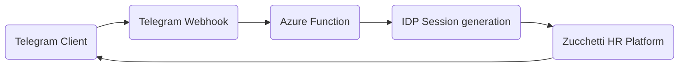

# zucchini 

An Azure Function ⚡ that can be used to perform basic actions through a Telegram-Bot on the Zucchetti HR Platform.

## Bot commands
* `/in`: Clock in
* `/out`: Clock out
* `/stamps`: Displays the stamps of the current date and the estimated clock-out time (Time when 8h are reached)

## Flow

## Telegram-Bot

For your bot to work, you must bind a Webhook to the Azure function. You can do that by invoking the `set-webhook` command as described in the [documentation](https://core.telegram.org/bots/api#setwebhook).

## Azure Function

For the function to work properly, you have to set following variables:
* `TelegramChatId`: Id which identifies your Telegram user
* `TelegramApiKey`: Api key of your Telegram bot
* `ZucchettiBaseUrl`: Base URL under which your Zucchetti Platform is reachable
* `ZucchettiUser`: Your username
* `ZucchettiPassword`: Your password

## Remarks
⚠️ Use this at your own risk. This software is provided without warranty of any kind. The authors are not liable for any claim, damages or other liability.
